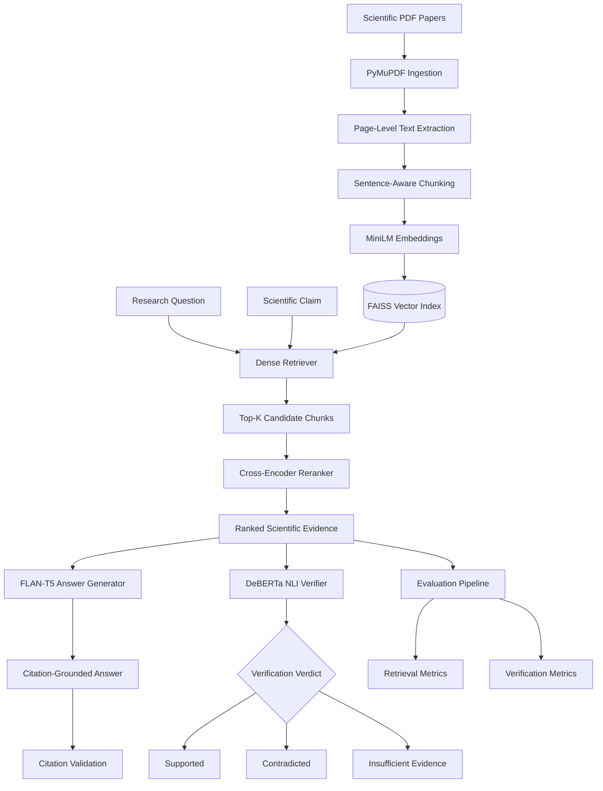
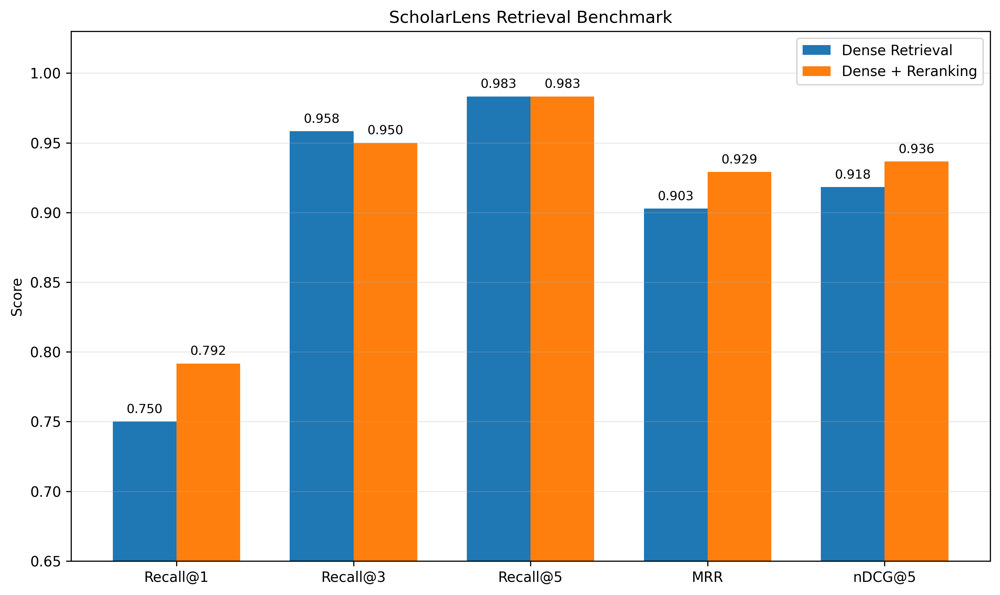
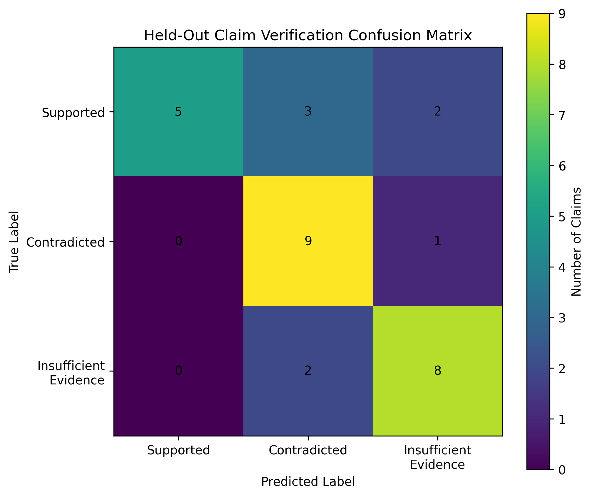
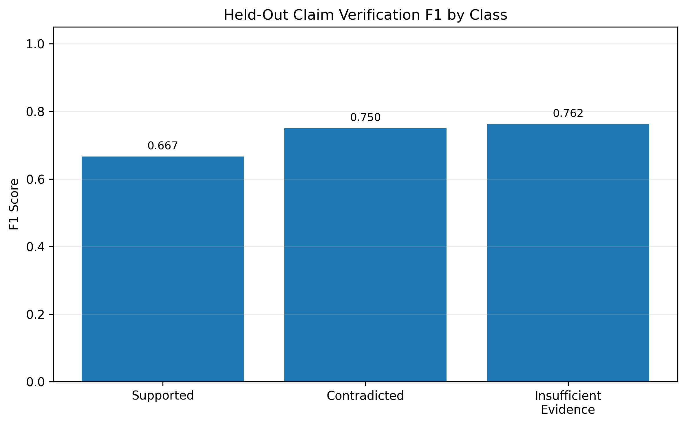
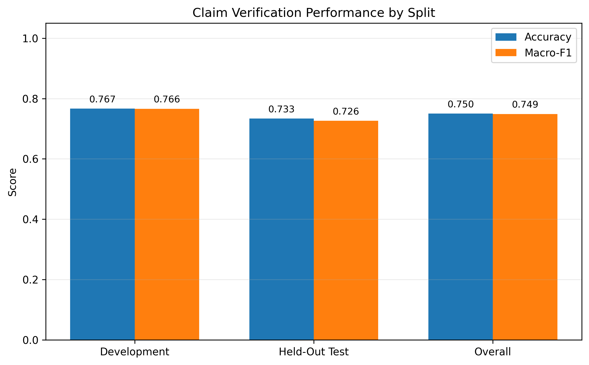

# ScholarLens AI


### Retrieval-Augmented Scientific Literature Search, Evidence Verification, and Citation-Grounded Answer Generation

ScholarLens AI is an end-to-end NLP system for semantic scientific literature retrieval, evidence reranking, claim verification, and citation-grounded answer generation. The project combines modern Retrieval-Augmented Generation (RAG), neural information retrieval, and Natural Language Inference (NLI) into a unified research-oriented pipeline.

## Highlights

- End-to-end Retrieval-Augmented Generation (RAG) pipeline for scientific literature
- Dense semantic retrieval over 20 foundational NLP research papers
- Cross-encoder neural reranking for improved evidence ranking
- Natural Language Inference (NLI)-based claim verification
- Citation-grounded answer generation with automatic evidence attribution
- Comprehensive benchmarking using Recall@K, MRR, nDCG, Accuracy, and Macro-F1
- Publication-style evaluation reports and visualizations

## Project Statistics

| Item | Value |
|------|------:|
| Research Papers | 20 |
| Indexed Chunks | 2,179 |
| Retrieval Queries | 60 |
| Verification Claims | 60 |
| Embedding Model | MiniLM-L6-v2 |
| Retrieval Index | FAISS |

---

## Key Results

### Retrieval Benchmark

Evaluated on a manually constructed benchmark of **60 scientific questions** covering 20 NLP and information-retrieval papers.

| Metric | Dense Retrieval | Dense + Reranking |
|---|---:|---:|
| Recall@1 | 75.00% | **79.17%** |
| Recall@3 | **95.83%** | 95.00% |
| Recall@5 | 98.33% | **98.33%** |
| MRR | 0.9028 | **0.9292** |
| nDCG@5 | 0.9183 | **0.9365** |

Cross-encoder reranking improved top-result relevance and ranking quality, increasing MRR by **2.92%** and nDCG@5 by **1.98%**.

### Claim Verification Benchmark

Evaluated on a balanced benchmark of **60 claims**:

- 20 Supported
- 20 Contradicted
- 20 Insufficient Evidence

| Split | Accuracy | Macro-F1 |
|---|---:|---:|
| Development | 76.67% | 0.7662 |
| **Held-Out Test** | **73.33%** | **0.7262** |
| Overall | 75.00% | 0.7489 |

Held-out test F1 scores:

| Class | Precision | Recall | F1 |
|---|---:|---:|---:|
| Supported | 1.000 | 0.500 | 0.667 |
| Contradicted | 0.643 | 0.900 | 0.750 |
| Insufficient Evidence | 0.727 | 0.800 | 0.762 |

---

## Features

- PDF ingestion and page-level text extraction
- Sentence-aware overlapping text chunking
- Scientific-text embeddings using Sentence Transformers
- FAISS cosine-similarity vector search
- Cross-encoder evidence reranking
- Three-way scientific claim verification
- Supported, Contradicted, and Insufficient Evidence verdicts
- Citation-grounded research-question answering
- Sentence-to-evidence citation validation
- Automated retrieval and verification benchmarks
- Recall@K, MRR, nDCG, accuracy, macro-F1, and confusion-matrix reporting
- JSON and Markdown evaluation artifacts
- Publication-quality evaluation figures

---

## System Architecture



---

## Pipeline

```text
PDF Papers
    │
    ▼
Text Ingestion
    │
    ▼
Sentence-Aware Chunking
    │
    ▼
MiniLM Embeddings
    │
    ▼
FAISS Vector Index
    │
    ▼
Dense Retrieval
    │
    ▼
Cross-Encoder Reranking
    │
    ├──────────────► Citation-Grounded Answer Generation
    │
    └──────────────► Scientific Claim Verification
                         │
                         ▼
          Supported / Contradicted / Insufficient Evidence
```

---

## Evaluation Figures

### Dense Retrieval vs Reranking



### Held-Out Claim Verification Confusion Matrix



### Held-Out F1 Score by Class



### Development, Test, and Overall Performance



---

## Models

| Pipeline Stage | Model or Library |
|---|---|
| PDF extraction | PyMuPDF |
| Embeddings | `sentence-transformers/all-MiniLM-L6-v2` |
| Vector search | FAISS |
| Reranking | `cross-encoder/ms-marco-MiniLM-L-6-v2` |
| Claim verification | `cross-encoder/nli-deberta-v3-base` |
| Answer generation | `google/flan-t5-base` |
| Evaluation | scikit-learn, NumPy, Matplotlib |

---

## Technologies

- Python
- PyTorch
- Hugging Face Transformers
- Sentence Transformers
- FAISS
- PyMuPDF
- NumPy
- scikit-learn
- Matplotlib

---

## Dataset

ScholarLens currently indexes **20 foundational papers** covering:

- Dense passage retrieval
- Late-interaction retrieval
- Unsupervised dense retrieval
- Retrieval-augmented generation
- Corrective and self-reflective RAG
- Citation-grounded generation
- Scientific claim verification
- Scientific-document embeddings
- Long-document transformers
- Long-context language-model behavior

After ingestion and sentence-aware chunking, the corpus contains:

| Statistic | Value |
|---|---:|
| Research papers | 20 |
| Indexed chunks | 2,179 |
| Embedding dimension | 384 |
| Retrieval queries | 60 |
| Verification claims | 60 |

---

## Project Structure

```text
scholarlens-ai/
├── configs/
├── data/
│
├── outputs/
│
├── src/
│
├── main.py
├── requirements.txt
├── README.md
└── LICENSE
```

---

## Installation

Clone the repository:

```bash
git clone https://github.com/krishnatejasai/ScholarLens.git
cd scholarlens-ai
```

Create and activate a virtual environment:

```bash
python3 -m venv .venv
source .venv/bin/activate
```

Install dependencies:

```bash
python3 -m pip install -r requirements.txt
```

---

## CLI Commands

| Command | Description |
|----------|-------------|
| `ingest` | Extract text and metadata from scientific PDF files |
| `chunk` | Split processed papers into overlapping retrieval chunks |
| `embed` | Generate dense embeddings and build the FAISS index |
| `retrieve` | Perform dense semantic evidence retrieval |
| `rerank` | Rerank retrieved passages using a cross-encoder |
| `verify` | Verify scientific claims against retrieved evidence |
| `answer` | Generate citation-grounded answers |
| `eval-retrieval` | Evaluate dense retrieval and reranking |
| `prepare-claims` | Prepare evidence for claim-verification evaluation |
| `eval-claims` | Evaluate the scientific claim-verification pipeline |
| `figures` | Generate evaluation figures |
| `report` | Generate consolidated evaluation reports |
| `analyze-claim-errors` | Analyze claim-verification errors |

---

## Build the Search Index

Place scientific PDF files inside:

```text
data/raw_papers/
```

Run ingestion:

```bash
python main.py ingest
```

Generate overlapping chunks:

```bash
python main.py chunk
```

Generate embeddings and build the FAISS index:

```bash
python main.py embed
```

---

## Usage

### Dense Retrieval

```bash
python main.py retrieve \
"What problem does retrieval-augmented generation solve?" \
--top-k 5
```

### Cross-Encoder Reranking

```bash
python main.py rerank \
"How does retrieval-augmented generation combine retrieval and generation?" \
--retrieve-k 15 \
--top-k 5
```

### Scientific Claim Verification

```bash
python main.py verify \
"RAG combines parametric memory with a non-parametric document index."
```

Example verdict:

```text
Verdict: SUPPORTED
Best support score: 0.99
Paper: Retrieval-Augmented Generation for Knowledge-Intensive NLP Tasks
Page: 1
```

### Citation-Grounded Answer Generation

```bash
python main.py answer \
"How does Self-RAG decide when to retrieve and critique its outputs?"
```

### Retrieval Evaluation

```bash
python main.py eval-retrieval
```

### Claim Verification Evaluation

```bash
python main.py prepare-claims
python main.py eval-claims
```

### Generate Evaluation Figures

```bash
python main.py figures
```

### Generate Evaluation Reports

```bash
python main.py report
```

---

## Evaluation Methodology

### Retrieval

Each query is associated with one or more relevant papers. Chunk-level search results are collapsed into paper-level rankings before calculating:

- Recall@1
- Recall@3
- Recall@5
- Mean Reciprocal Rank
- nDCG@5

Dense retrieval and dense-plus-reranking configurations are evaluated on the same 60-query benchmark.

### Claim Verification

The verification benchmark contains 60 balanced claims divided into:

- 30 development claims
- 30 held-out test claims

For each claim, ScholarLens:

1. Retrieves the top 20 candidate chunks.
2. Reranks them using a cross-encoder.
3. Retains the top five evidence passages.
4. Applies an NLI verifier to each claim-evidence pair.
5. Aggregates entailment, contradiction, and neutral probabilities.
6. Returns Supported, Contradicted, or Insufficient Evidence.

The held-out test split is used as the primary verification result.

---

## Limitations

- The corpus contains only 20 papers from a focused NLP and information-retrieval domain.
- The benchmark was manually constructed and is not a replacement for large public benchmarks.
- Full-passage NLI can be affected by unrelated sentences or bibliography text inside a chunk.
- Supported-claim recall remains lower than the other classes because scientific paraphrases may be classified as neutral or contradictory.
- The current answer generator is relatively small and can produce concise or incomplete synthesis.
- The pipeline does not currently perform hybrid BM25 and dense retrieval.
- PDF extraction quality depends on the document layout and embedded text quality.

---

## Future Improvements

- Hybrid Dense + Sparse Retrieval (BM25 + Dense)
- ColBERT-style Late Interaction Retrieval
- Domain-specific scientific embedding models
- Metadata-aware retrieval using author, venue, and publication year
- Multi-hop scientific evidence retrieval
- Long-context LLM answer generation
- FastAPI REST API
- Interactive Streamlit web application
- Docker support and cloud deployment

---

## License

This project is released under the [MIT License](LICENSE).

## Author

**Sai Sri Krishna Teja Sanku**  
M.S. in Computer Science  
University of Florida

---

This project was developed as an independent research-oriented implementation to explore modern Retrieval-Augmented Generation (RAG), neural information retrieval, and scientific claim verification pipelines.